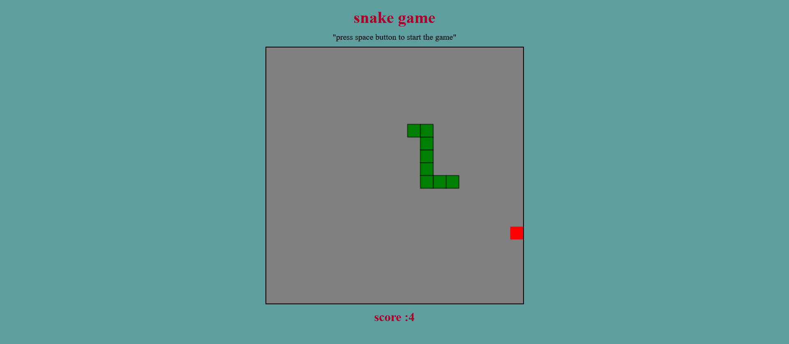

# Snake-Game

A Snake Game in JavaScript involves controlling a snake that moves around the screen, eating food to grow longer, while avoiding collisions with walls and its own body. The game is implemented using an HTML <canvas> for drawing, and JavaScript for handling movement, collisions, and game logic. 

  
   <h1>Preview</h1>   
   
   

[Live](https://alagar2604.github.io/Snake-game-use-js/) 
     
   

